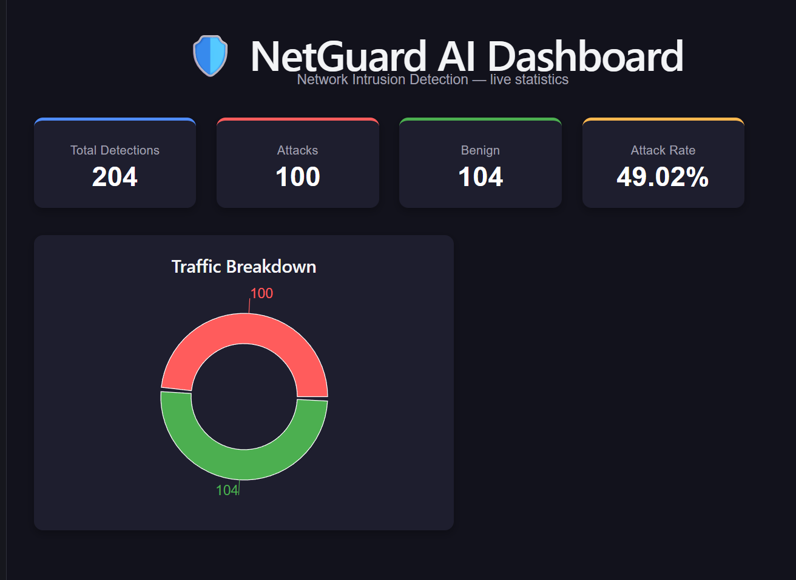

# NetGuard AI — Cloud-Native AI Intrusion Detection System

A full-stack, machine-learning-powered Network Intrusion Detection System (NIDS) that classifies network traffic as benign or attack, serves predictions through a web API, persists them to a database, and visualizes live statistics on a React dashboard.

Author: Omar Azzam (@OmarAzzam2104) — Computer Science student, German Jordanian University.

---



---

## What is this project?

Traditional intrusion detection tools (e.g. Snort) rely on hand-written signatures — a human has to know an attack pattern in advance and encode it as a rule. NetGuard AI takes the machine-learning approach instead: it was trained on ~2.8 million real, labeled network connections and learned the statistical patterns that separate normal traffic from attacks, so it can flag malicious flows without a human writing an explicit rule for each one.

The trained model is served through a REST API. Every prediction is stored in a PostgreSQL database, and a React dashboard reads aggregated statistics from the API to display live charts.

---

## Project status

| # | Layer | Status |
|---|-------|--------|
| 1 | Development environment (WSL2, Python, Docker, Git) | Done |
| 2 | ML model — Random Forest on CICIDS2017 | Done |
| 3 | FastAPI backend (/predict, /health, /stats) | Done |
| 4 | PostgreSQL persistence (SQLAlchemy ORM) | Done |
| 5 | React dashboard with live stat cards + donut chart | Done |
| 6 | Docker containerization (backend + database) | Done |
| 7 | AWS deployment (EC2, S3, RDS — free tier) | Planned |
| 8 | CI/CD with GitHub Actions + Bandit security scan | Planned |

---

## Tech stack

- Machine Learning: Python, scikit-learn (Random Forest), pandas, NumPy
- Backend: FastAPI, Uvicorn, Pydantic, SQLAlchemy, joblib
- Database: PostgreSQL (run in Docker)
- Frontend: React (Vite), Recharts
- Dataset: CICIDS2017 (Canadian Institute for Cybersecurity, UNB)
- Planned: AWS (EC2 / S3 / RDS), GitHub Actions, Bandit

---

## Architecture
React dashboard --HTTP--> FastAPI backend --> Random Forest model
(charts) <--JSON-- (/predict, /stats) (predictions)
|
v
PostgreSQL
(stored detections)

Each prediction the API makes is written to PostgreSQL. The dashboard calls the /stats endpoint, which runs aggregate queries against that table and returns summary counts the charts render.

---

## The machine learning model

### Dataset

The model is trained on the CICIDS2017 dataset, created by the Canadian Institute for Cybersecurity at the University of New Brunswick. It contains roughly 2.8 million labeled network flows, each described by 78 numeric features (flow duration, packet counts per direction, TCP flag counts, inter-arrival times, etc.) extracted with CICFlowMeter, plus a label naming the traffic as benign or one of 14 attack types.

Note on the data: the raw CSV (~800 MB) is not included in this repository. The original dataset is available from the Canadian Institute for Cybersecurity (https://www.unb.ca/cic/datasets/ids-2017.html).

### Key design decisions

Binary classification (benign vs. attack). CICIDS2017 is severely imbalanced — over 70% of traffic is benign, and some attack types have only a handful of examples (Heartbleed appears 11 times). Learning 15 separate classes from so few examples is unreliable, so the problem was reframed as binary: benign (0) vs. attack (1). This turns an impossible task (learn an attack type from 11 rows) into a tractable one (learn "not benign" from ~557k attack rows). Multiclass classification is noted as future work.

Handling the data's known defects. The dataset contains missing (NaN) and infinite values (some per-second rate features divide by a near-zero duration). These were converted and dropped — about 0.1% of rows — after confirming the proportion was small enough that removal wouldn't bias the model.

Training on a stratified sample. Training on all 2.8M rows exceeded available memory on the development machine. A stratified 200k-row sample (preserving the benign/attack ratio) was used instead — a deliberate trade-off: near-identical model quality at a fraction of the memory and training time.

Honest evaluation. The data was split 70/30 into training and test sets, and the model is evaluated only on the held-out 30% it never saw during training, so the score reflects generalization, not memorization. Because of the class imbalance, plain accuracy is not the headline metric — a lazy model that always predicts "benign" would score ~80% while catching zero attacks. Precision, recall, and F1 on the attack class are reported instead.

### Result

On the held-out test set the Random Forest achieves an F1 score of ~0.99 for attack detection. (Note: tree-based models are known to score very high on CICIDS2017; real-world traffic would be noisier, and this is a documented limitation of benchmarking on this dataset.)

---

## API endpoints

| Method | Endpoint | Description |
|--------|----------|-------------|
| GET  | /        | Basic liveness message |
| GET  | /health  | Confirms the model loaded and reports the expected feature count |
| POST | /predict | Accepts 78 flow features as JSON, classifies, stores the result, returns prediction + confidence |
| GET  | /stats   | Returns aggregate detection statistics from the database |

The backend loads the trained model once at startup (not per request) for performance, and validates incoming requests against a Pydantic schema so malformed input is rejected before it reaches the model. Predictions are persisted with the SQLAlchemy ORM, which parameterizes queries (mitigating SQL injection).

Example /predict response:

```json
{
  "prediction": "ATTACK",
  "is_attack": true,
  "confidence": 0.99
}
```

---

## Running it locally

Requires Python 3.12+, Node.js, and Docker.

1. Start the database (PostgreSQL in Docker):

```bash
docker run --name netguard-db -e POSTGRES_PASSWORD=netguard123 -e POSTGRES_DB=netguard -p 5432:5432 -d postgres:16
```

2. Start the backend API:

```bash
python3 -m venv venv
source venv/bin/activate
pip install -r requirements.txt
uvicorn backend.main:app --reload
```

Interactive API docs: http://127.0.0.1:8000/docs

3. (Optional) Populate the database with sample detections:

```bash
python3 generate_data.py
```

4. Start the frontend dashboard:

```bash
cd frontend
npm install
npm run dev
```

Open the dashboard at http://localhost:5173

### Retraining the model (optional)

Requires the CICIDS2017 CSV at ml/data/combinenew.csv:

```bash
python3 ml/train.py
```

---

## Project structure
netguard-ai/
ml/
train.py # Data cleaning, training, evaluation, model saving
models/
netguard_model.joblib # Trained Random Forest (loaded by the API)
feature_columns.joblib # Feature order the model expects
backend/
main.py # FastAPI app: /, /health, /predict, /stats
database.py # SQLAlchemy models + DB connection
frontend/
src/App.jsx # React dashboard (stat cards + donut chart)
generate_data.py # Sends sample flows to the API to populate the DB
docs/
dashboard.png # Dashboard screenshot
Dockerfile
.dockerignore
requirements.txt
README.md

---

## Roadmap

- Interactive "test the model" demo on the dashboard (submit a flow, get a verdict)
- Deploy to AWS free tier (EC2 + RDS + S3)
- CI/CD pipeline with GitHub Actions, including a Bandit security scan
- Multiclass classification (identify the specific attack type)

---

## Acknowledgements

Dataset: Iman Sharafaldin, Arash Habibi Lashkari, and Ali A. Ghorbani, "Toward Generating a New Intrusion Detection Dataset and Intrusion Traffic Characterization," Canadian Institute for Cybersecurity (CIC), University of New Brunswick, 2017.
